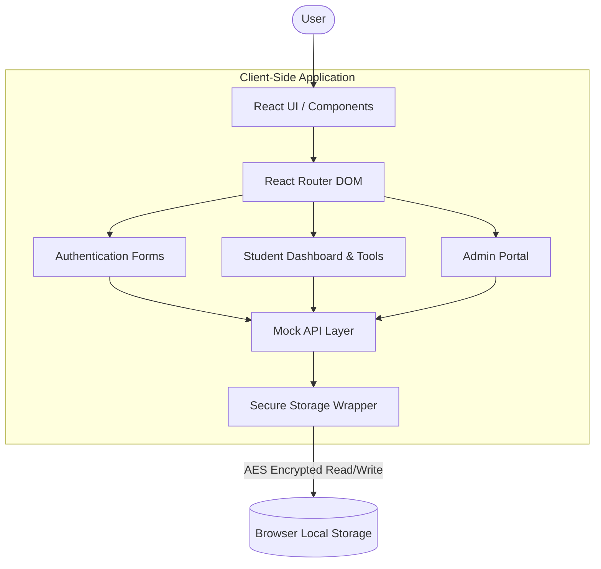

# EduPrep AI

EduPrep AI is a comprehensive, client-side educational platform designed to help students prepare for competitive exams. Built with a modern tech stack, it features secure local storage, mock tests, progress tracking, and AI integration for intelligent study strategies.

## 🚀 Features

*   **Student Dashboard**: Track progress, view study strategies, and manage daily to-do lists.
*   **Admin Portal**: Secure sub-system for administrators to monitor user statistics and overall platform health.
*   **Encrypted Local Storage**: All user data, including credentials and progress, is securely encrypted in the browser's local storage using AES encryption (crypto-js).
*   **Mock Tests**: Interactive mock tests with instant feedback and performance tracking.
*   **AI Integration**: Settings panel to configure AI providers (Gemini, OpenAI, Anthropic, xAI) for personalized study plans.
*   **Responsive Design**: A beautiful, modern interface built with Tailwind CSS, accessible on devices of all sizes.

## 🛠️ Technology Stack

*   **Framework**: [React 18](https://react.dev/)
*   **Build Tool**: [Vite](https://vitejs.dev/)
*   **Language**: [TypeScript](https://www.typescriptlang.org/)
*   **Styling**: [Tailwind CSS](https://tailwindcss.com/)
*   **Routing**: [React Router v6](https://reactrouter.com/) (using `HashRouter` for static hosting compatibility like GitHub Pages)
*   **Icons**: [Lucide React](https://lucide.dev/icons/)
*   **Security / Encryption**: [crypto-js](https://cryptojs.gitbook.io/docs/)
*   **Deployment**: GitHub Pages (Automated via GitHub Actions)

## 📂 Project Structure

```text
├── .github/
│   └── workflows/
│       └── static.yml       # GitHub Actions workflow for static deployment to Pages
├── public/                  # Static assets that don't need bundling
├── src/
│   ├── components/          # Reusable UI components
│   ├── hooks/               # Custom React hooks (e.g., useAIConfig)
│   ├── lib/                 # Utility functions and core logic
│   │   ├── api.ts           # Mock API handling data operations
│   │   └── storage.ts       # Secure AES encrypted local storage wrapper
│   ├── pages/               # Top-level page components representing routes
│   │   ├── AdminDashboard.tsx
│   │   ├── AdminLogin.tsx
│   │   ├── Login.tsx
│   │   ├── Register.tsx
│   │   └── StudentDashboard.tsx
│   ├── App.tsx              # Main application component & Router definition
│   ├── index.css            # Global CSS (Tailwind entry point)
│   ├── main.tsx             # React entry point
│   ├── types.ts             # Global TypeScript interface definitions
├── index.html               # Main HTML template
├── package.json             # Project dependencies and npm scripts
├── postcss.config.js        # PostCSS configuration for Tailwind
├── tailwind.config.js       # Tailwind CSS configuration
├── tsconfig.json            # TypeScript configuration
└── vite.config.ts           # Vite bundler configuration
```

## 🏗️ Architecture Flow



## 💻 Installation & Setup

### Prerequisites

*   [Node.js](https://nodejs.org/en/) (Version 18 or higher recommended)
*   npm (comes with Node.js) or yarn / pnpm

### Getting Started

1.  **Clone the repository:**
    ```bash
    git clone https://github.com/vidyarthi-ai/EduPrep.git
    cd EduPrep
    ```

2.  **Install dependencies:**
    ```bash
    npm install
    ```

3.  **Start the development server:**
    ```bash
    npm run dev
    ```
    The application will be available at `http://localhost:3000` (or another port if 3000 is occupied).

4.  **Build for production:**
    ```bash
    npm run build
    ```
    This will generate an optimized, production-ready static build in the `dist` directory.

## 🔐 Credentials for Demo

During local development or demo previews, the application initializes default accounts:

*   **Student Login**: `student@edu.test` | Password: `password`
*   **Admin Access**: Please use the hidden `/admin-access` hash route (e.g., `/#/admin-access`) to access the admin portal. Credentials: `admin@prepai.system` | Password: `A3$p9k#M2!xQ`

*(Note: Data is persisted in your browser's local storage securely using AES encryption. Clearing site data will reset these accounts.)*

## 🌐 Deployment to GitHub Pages

The project is configured to deploy automatically to GitHub Pages using GitHub Actions.

1.  Whenever code is pushed to the `main` branch, the `.github/workflows/static.yml` workflow triggers.
2.  It installs dependencies, builds the Vite application (output to `./dist`), and deploys the static files to the `gh-pages` environment.
3.  The use of `HashRouter` ensures that deep links work correctly on GitHub Pages servers without needing server-side rewrite rules.

